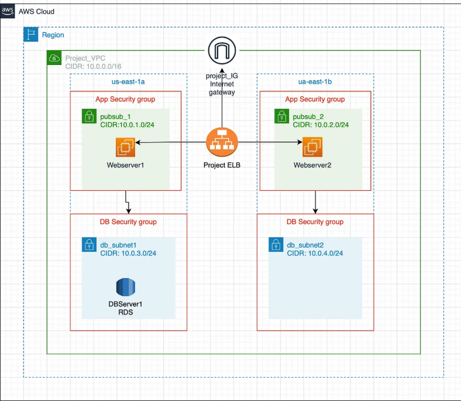

# AWS 2-Tier Application with Terraform

This project provisions a modular, production-style 2-tier architecture on AWS using Terraform. It includes:

- ✅ VPC with public/private subnets across 2 AZs
- 🌐 Internet Gateway + NAT Gateway
- 🖥️ EC2 instances running Apache + Flask
- ⚖️ Application Load Balancer (ALB)
- 🗄️ RDS (MySQL) with secure connectivity
- 🔐 Security groups and route tables
- 📦 Modular Terraform structure

## 📊 Architecture Diagram


## 🚀 Deployment Instructions

```bash
terraform init
terraform plan
terraform apply
